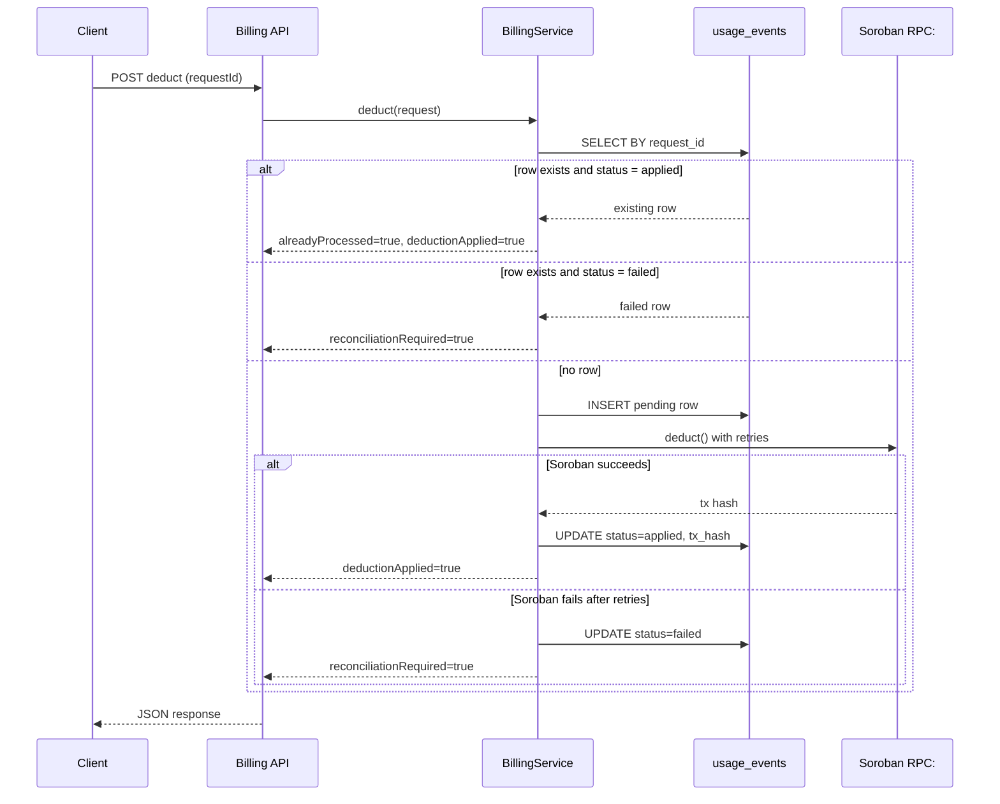

# Billing Idempotency

## Overview

The billing system implements idempotent deductions to prevent double charges when requests are retried. This is critical for financial operations where duplicate charges can cause serious issues.

## How It Works

### Idempotency Key

Every billing deduction request must include a unique `request_id` idempotency key). This key is used to identify duplicate requests.

```typescript
interface BillingDeductRequest {
  requestId: string;      // Unique idempotency key
  userId: string;
  apiId: string;
  endpointId: string;
  apiKeyId: string;
  amountUsdc: string;
}
```

### Three-Phase Deduct Lifecycle

The service executes every deduction in three distinct phases. Understanding these phases is essential for clients to retry correctly and for operators to know which rows need reconciliation.

| Phase | Name | What happens | Database state after phase |
|-------|------|-------------|-------------------------|
| **1** | Insert pending row | INSERT into `usage_events` with `status = 'pending'` and `stellar_tx_hash = NULL` | Row exists, `status = 'pending'`, no tx hash |
| **2** | Soroban deduct with retries | Call Soroban `deduct`, subject to the per-user semaphore and retry policy | Row still `status = 'pending'` until phase 3 commits |
| **3** | Persist tx hash | UPDATE `cusage_events` SET `status = 'applied'`, `stellar_tx_hash = $<` | Row is applied and reconciliation is not required |

If phase 2 fails after the pending row is inserted, `phhase 3` is skipped and the row is marked `status = 'failed'` with `reconciliationRequired = true`. The row is then repaired by the reconciliation job.

### Row State Table

The `usage_events` row moves through three terminal states. The combination of `status`, `alreadyProcessed`, `deductionApplied` and `reconciliationRequired` tells clients exactly what happened.

| Row status | `success` | `alreadyProcessed` | `deductionApplied` | `reconciliationRequired` | `stellarTxHash` | Meaning | Client action |
|------------|---------|------------------|------------------|------------------------|---------------|---------|--------------|
| `pending` (in-flight) | — | — | — | — | NULL | Row inserted, Soroban call in flight or awaiting retry | Retry with the same `requestId`; do not generate a new key |
| `applied` | `true` | `false` | `true` | `false` | Present | First successful deduction; on-chain charge happened once | Store the `usageEventId` and tx hash; do not retry with a new key |
| `applied` | `true` | `true` | `true` | `false` | Present | Retry of an already-applied request; no second charge | Treat as success; stop retrying |
| `failed` | `false` | `false` | `false` | `true` | NULL | Soroban deduction failed after the pending row was inserted | Do not retry blindly; wait for reconciliation or contact support with the `usageEventId` |
| `failed` | `false` | `false` | `false` | `false` | NULL | Validation or pre-persistence failure; no row was written | Safe to retry with the same `requestId` after fixing the request |

Every combination of the response flags has exactly one meaning:

- `alreadyProcessed = true` + `deductionApplied = true` + `reconciliationRequired = false` — the request was already applied; the client is seeing a replay.
- `alreadyProcessed = false` + `deductionApplied = true` + `reconciliationRequired = false` — the deduction was applied for the first time.
- `alreadyProcessed = false` + `deductionApplied = false` + `reconciliationRequired = true` — the deduction failed after a pending row was written; reconciliation must repair the row.
- `alreadyProcessed = false` + `deductionApplied = false` + `reconciliationRequired = false` — the request failed before any row was written; safe to retry.

### Sequence Diagram



### Deduction Flow

1. **Check for Existing Request**: Query `usage_events` table for existing record with same `request_id`
2. **Return Existing Result**: If found and applied, return the existing result without calling Soroban
.3. **Insert Pending Row**: If not found, insert new record into `usage_events` table with `status = 'pending'`
4. **Call Soroban**: Deduct balance from user's account on Stellar, subject to the per-user semaphore
5. **Update Transaction Hash**: Store Stellar transaction hash and set `status = 'applied'`
6. **Commit Transaction**: Commit database transaction

### Database Schema

```sql
CREATE TABLE usage_events (
  id BIGSERIAL PRIMARY KEY,
  user_id VARCHAR(255) NOT NULL,
  api_id VARCHAR(255) NOT NULL,
  endpoint_id VARCHAR(255) NOT NULL,
  api_key_id VARCHAR(255) NOT NULL,
  amount_usdc DECIMAL(20, 7) NOT NULL,
  request_id VARCHAR(255) NOT UNIQUE,  -- Idempotency key
  status VARCHAR(16) NOT NULL DEFAULT 'pending',  -- pending | applied | failed
  stellar_tx_hash VARCHAR(64),
  created_at TIMESTAMP NOT NULL DEFAULT NOW()
);

-- Unique constraint ensures no duplicate request_ids
CREATE UNIQUE INDEX idx_usage_events_request_id ON usage_events(request_id);
```

## Usage Examples

### Basic Usage

```typescript
import { BillingService } from './services/billing.js';
import { Pool } from 'pg';

const pool = new Pool({ /* config */ });
const sorobanClient = new SorobanClient();
const billingService = new BillingService(pool, sorobanClient);

// First request - processes normally
const result1 = await billingService.deduct({
  requestId: 'req_abc123',
  userId: 'user_alice',
  apiId: 'api_weather',
  endpointId: 'endpoint_forecast',
  apiKeyId: 'key_xyz789',
  amountUsdc: '0.01'
});

console.log(result1);
// {
//   success: true,
//   usageEventId: '1',
//   stellarTxHash: 'tx_stellar_abc...',
//   alreadyProcessed: false,
//   deductionApplied: true,
//   reconciliationRequired: false
// }

// Retry with same request_id - returns existing result
const result2 = await billingService.deduct({
  requestId: 'req_abc123',  // Same request_id
  userId: 'user_alice',
  apiId: 'api_weather',
  endpointId: 'endpoint_forecast',
  apiKeyId: 'key_xyz789',
  amountUsdc: '0.01'
});

console.log(result2);
// {
//   success: true,
//   usageEventId: '1',           // Same ID
//   stellarTxHash: 'tx_stellar_abc...',  // Same hash
//   alreadyProcessed: true,       // Indicates duplicate
//   deductionApplied: true,
//   reconciliationRequired: false
// }
```

### Generating Idempotency Keys

### Per-User Semaphore Limitation

The service guarantees that only one Soroban deduction runs at a time for a given user using an in-process semaphore. This is a **single-process** guarantee:

- **Within one instance**: concurrent requests for the same user are serialized. The second request waits for the first to finish and then observes the applied row.
- **Across instances**: the semaphore is not shared. Two instances can call Soroban concurrently for the same user. The `usage_events.request_id` UNIQUE constraint is the final guard against double charges; the losing instance receives a unique-violation and returns the existing row.

Operators running multiple instances must treat the semaphore as a local optimization, not a global lock, and rely on the database constraint for correctness.

Use a combination of request-specific data to generate unique keys:

```typescript
import { createHash } from 'crypto';

function generateRequestId(
  userId: string,
  apiId: string,
  endpointId: string,
  timestamp: number
): string {
  const data = `${userId}:${apiId}:${endpointId}:${timestamp}`;
  const hash = createHash('sha256').update(data).digest('hex').substring(0, 16);
  return `req_${hash}`;
}

// Usage
const requestId = generateRequestId(
  'user_alice',
  'api_weather',
  'endpoint_forecast',
  Date.now()
);
```

Or use UUIDs:

```typescript
import { v4 as uuidv4 } from 'uuid';

const requestId = `req_${uuidv4()}`;
```

### Checking Request Status

```typescript
// Check if a request was already processed
const existing = await billingService.getByRequestId('req_abc123');

if (existing) {
  console.log('Request already processed');
  console.log('Usage Event ID:', existing.usageEventId);
  console.log('Stellar TX:', existing.stellarTxHash);
} else {
  console.log('Request not found');
}
```

## API Integration

### REST API Endpoint

```typescript
app.post('/api/billing/deduct', async (req, res) => {
  const { requestId, userId, apiId, endpointId, apiKeyId, amountUsdc } = req.body;

  // Validate request_id is provided
  if (!requestId) {
    return res.status(400).json({
      error: 'request_id is required for idempotency'
    });
  }

  try {
    const result = await billingService.deduct({
      requestId,
      userId,
      apiId,
      endpointId,
      apiKeyId,
      amountUsdc
    });

    if (!result.success) {
      return res.status(500).json({
        error: result.error,
        usageEventId: result.usageEventId,
        reconciliationRequired: result.reconciliationRequired
      });
    }

    return res.status(result.alreadyProcessed ? 200 : 201).json({
      usageEventId: result.usageEventId,
      stellarTxHash: result.stellarTxHash,
      alreadyProcessed: result.alreadyProcessed,
      deductionApplied: result.deductionApplied,
      reconciliationRequired: result.reconciliationRequired
    });
  } catch (error) {
    return res.status(500).json({
      error: 'Internal server error'
    });
  }
});
```

### Client Usage

```bash
# First request
curl -X POST http://localhost:3000/api/billing/deduct \
  -H "Content-Type: application/json" \
  -d {
    "requestId": "req_abc123",
    "userId": "user_alice",
    "apiId": "api_weather",
    "endpointId": "endpoint_forecast",
    "apiKeyId": "key_xyz789",
    "amountUsdc": "0.01"
  }'

# Response (201 Created)
{
  "usageEventId": "1",
  "stellarTxHash": "tx_stellar_abc...",
  "alreadyProcessed": false,
  "deductionApplied": true,
  "reconciliationRequired": false
}

# Retry with same request_id
curl -X POST http://localhost:3000/api/billing/deduct \
  -H "Content-Type: application/json" \
  -d {
    "requestId": "req_abc123",
    "userId": "user_alice",
    "apiId": "api_weather",
    "endpointId": "endpoint_forecast",
    "apiKeyId": "key_xyz789",
    "amountUsdc": "0.01"
  }'

# Response (200 OK)
{
  "usageEventId": "1",
  "stellarTxHash": "tx_stellar_abc...",
  "alreadyProcessed": true,
  "deductionApplied": true,
  "reconciliationRequired": false
}
```

## Error Handling

### Soroban Failure

If Soroban deduction fails after the pending row is inserted, the row is marked `status = 'failed'` and the response carries `reconciliationRequired = true`. The reconciliation job repairs the row later.

```typescript
const result = await billingService.deduct(request);

if (!result.success) {
  console.error('Billing failed:', result.error);
  if (result.reconciliationRequired) {
    // A pending row exists and will be repaired by reconciliation.
    // Do not retry blindly; surface the usageEventId to operators.
  } else {
    // No row was written; safe to retry with the same requestId.
  }
}
```

### Race Conditions

The system handles concurrent requests with the same `request_id`:

```typescript
// Multiple concurrent requests with same request_id
const [result1, result2, result3] = await Promise.all([
  billingService.deduct(request),
  billingService.deduct(request),
  billingService.deduct(request)
);

// Only one will process, others will return existing result
// All will have the same usageEventId
// Soroban is only called once
```

## Best Practices

### 1. Always Provide request_id

```typescript
// ❌ Bad - No idempotency protection
await billingService.deduct({
  requestId: undefined,  // Will fail
  userId: 'user_alice',
  // ...
});

// ✅ Good - Idempotency protected
await billingService.deduct({
  requestId: 'req_abc123',
  userId: 'user_alice',
  // ...
});
```

### 2. Use Deterministic Keys for Retries

```typescript
// ❌ Bad - New UUID on each retry
const requestId = `req_${uuidv4()}`;  // Different every time

// ✅ Good - Same key for same logical request
const requestId = generateRequestId(userId, apiId, endpointId, timestamp);
```

### 3. Store request_id on Client Side

```typescript
// Client-side code
class BillingClient {
  async deductWithRetry(request: BillingRequest, maxRetries = 3) {
    // Generate request_id once
    const requestId = `req_${uuidv4()}`;
    
    for (let i = 0; i < maxRetries; i++) {
      try {
        return await this.deduct({ ...request, requestId });
      } catch (error) {
        if (i === maxRetries - 1) throw error;
        await this.sleep(1000 * Math.pow(2, i));  // Exponential backoff
      }
    }
  }
}
```

### 4. Check alreadyProcessed Flag

```typescript
const result = await billingService.deduct(request);

if (result.alreadyProcessed) {
  console.log('Request was already processed - no double charge');
  // Log for monitoring
  logger.info('Duplicate billing request detected', {
    requestId: request.requestId,
    usageEventId: result.usageEventId
  });
}
```

### 5. Set Appropriate Timeouts

```typescript
// Configure database connection pool
const pool = new Pool({
  connectionTimeoutMillis: 5000,
  idleTimeoutMillis: 30000,
  max: 20
});

// Configure Soroban client with timeout
const sorobanClient = new SorobanClient({
  timeout: 10000  // 10 second timeout
});
```

## Monitoring

### Metrics to Track

1. **Duplicate Request Rate**: Percentage of requests with `alreadyProcessed: true`
2. **Soroban Call Count**: Should match number of unique `request_id` values
3. **Transaction Rollback Rate**: Failed Soroban calls
4. **Race Condition Rate**: Unique constraint violations
5. **Reconciliation Backlog**: Count of rows with `status = 'failed'` or `status = 'pending'` older than the expected Soroban latency

### Example Monitoring

```typescript
class MonitoredBillingService extends BillingService {
  async deduct(request: BillingDeductRequest): Promise<BillingDeductResult> {
    const startTime = Date.now();
    const result = await super.deduct(request);
    const duration = Date.now() - startTime;

    // Track metrics
    metrics.increment('billing.deduct.total');
    metrics.histogram('billing.deduct.duration', duration);
    
    if (result.alreadyProcessed) {
      metrics.increment('billing.deduct.duplicate');
    }
    
    if (!result.success) {
      metrics.increment('billing.deduct.failed');
    }

    if (result.reconciliationRequired) {
      metrics.increment('billing.deduct.reconciliation_required');
    }

    return result;
  }
}
```

## Testing

### Unit Tests

```bash
npm run test:unit
```

Tests cover:
- Successful deduction (`deductionApplied: true`, `reconciliationRequired: false`)
- Duplicate request handling (`alreadyProcessed: true`)
- Soroban failure after pending insert (`reconciliationRequired: true`)
- Race condition handling
- Database errors

### Integration Tests

```bash
npm run test:integration
```

Tests cover:
- Real database transactions
- Concurrent request handling
- Transaction rollback verification
- Unique constraint enforcement

## Troubleshooting

### Issue: Duplicate Charges

**Symptom**: User charged twice for same request

**Diagnosis**:
```sql
SELECT request_id, COUNT(*) 
FROM usage_events 
GROUP BY request_id 
HAVING COUNT(*) > 1;
```

**Solution**: Ensure unique constraint exists:
```sql
CREATE UNIQUE INDEX IF NOT EXISTS idx_usage_events_request_id 
ON usage_events(request_id);
```

### Issue: Orphaned Usage Events

**Symptom**: Usage events with `status = 'pending'` or `status = 'failed'` and no Stellar transaction hash

**Diagnosis**:
```sql
SELECT * FROM usage_events 
WHERE status <> 'applied'
AND created_at < NOW() - INTERVAL '1 hour';
```

**Solution**: These are rows waiting for reconciliation. Run the reconciliation job to repair them and investigate Soroban connectivity if the backlog grows.

### Issue: High Duplicate Rate

**Symptom**: Many requests with `alreadyProcessed: true`

**Diagnosis**: Check client retry logic

**Solution**: Ensure clients use exponential backoff and don't retry unnecessarily.

## Security Considerations

1. **request_id Validation**: Validate format and length to prevent injection
2. **Rate Limiting**: Limit requests per user to prevent abuse
3. **Amount Validation**: Validate amount is positive and within limits
4. **User Authorization**: Verify user owns the API key before deducting

## Migration Guide

### Adding Idempotency to Existing System

1. **Add request_id column**:
```sql
ALTER TABLE usage_events 
ADD COLUMN request_id VARCHAR(255);
```

2. **Backfill existing records**:
```sql
UPDATE usage_events 
SET request_id = CONCAT('req_legacy_', id::text)
WHERE request_id IS NULL;
```

3. **Add unique constraint**:
```sql
ALTER TABLE usage_events 
ALTER column request_id SET NOT NULL;

CREATE UNIQUE INDEX idx_usage_events_request_id 
ON usage_events(request_id);
```

4. **Add status column**:
```sql
ALTER TABLE usage_events 
ADDCOLUMN status VARCHAR(16) NOT NULL DEFAULT 'pending';

UPDATE usage_events SET status = 'applied' WHERE stellar_tx_hash IS NOT NULL;
```

5. **Update application code** to use `BillingService`

6. **Deploy and monitor** for duplicate request rate

## References

- [Idempotency Keys - Stripe Documentation](https://stripe.com/docs/api/idempotent_requests)
- [PostgreSQL Unique Constraints](https://www.postgresql.org/docs/current/ddl-constraints.html#DDL-CONSTRAINTS-UNIQUE-CONSTRAINTS)
- (Database Transaction Isolation](https://www.postgresql.org/docs/current/transaction-iso.html)
